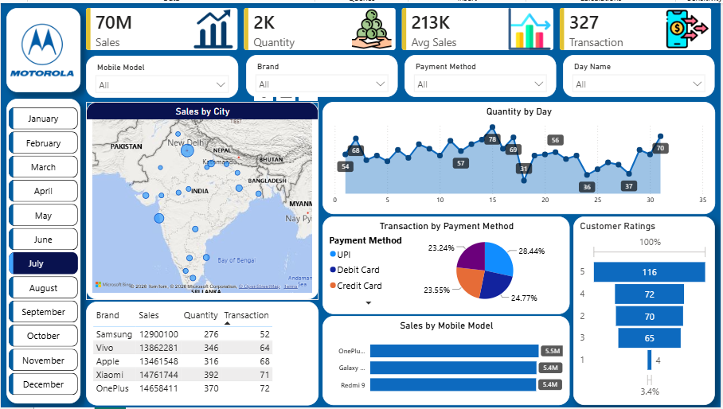

# 📱 Motorola Mobile Sales Dashboard | Power BI

<p align="center">
  
  
  
  
</p>

---

# 📌 Overview

The **Motorola Mobile Sales Dashboard** is an interactive Power BI project developed to analyze Motorola mobile sales performance across different regions, products, customers, and time periods.

This was my **first Power BI Dashboard project**, created to strengthen my Business Intelligence and Data Analytics skills. The dashboard converts raw sales data into meaningful business insights through interactive visualizations and dynamic reporting.

# 📷 Dashboard Preview

## 🏠 Dashboard



---

# 🎯 Project Objectives

- Analyze Motorola mobile sales performance.
- Track total revenue and sales trends.
- Identify top-performing products.
- Compare regional sales performance.
- Monitor monthly sales growth.
- Build an interactive dashboard for business decision-making.

---

---

# 📊 Dashboard Features

### 📌 KPI Cards

- 💰 Total Sales
- 📦 Total Orders
- 📱 Total Quantity Sold
- 📈 Average Sales
- 💵 Total Revenue

---

### 📊 Interactive Visuals

- Monthly Sales Trend
- Product-wise Sales
- Brand Performance
- Region-wise Sales
- Customer Analysis
- Sales Distribution
- Dynamic Slicers

---

# 🛠 Tech Stack

| Tool | Purpose |
|------|---------|
| Power BI | Dashboard Development |
| Excel | Data Source |
| Power Query | Data Cleaning |
| DAX | Calculated Measures |
| Data Modeling | Relationship Management |

---

# 📂 Dataset

The dataset includes:

- Order Date
- Customer Information
- Mobile Model
- Region
- Sales
- Quantity
- Revenue
- Payment Method

---

# 📈 Key Insights

- Sales performance can be monitored across multiple regions.
- Monthly sales trends help identify peak sales periods.
- Product-level analysis highlights top-selling mobile models.
- Interactive filters allow detailed exploration of sales data.
- Dashboard supports data-driven business decisions.

---

# 🚀 Skills Demonstrated

- Data Cleaning
- Data Transformation
- Power Query
- Data Modeling
- DAX Measures
- Dashboard Design
- Data Visualization
- Business Intelligence
- Interactive Reporting

---

# 📁 Repository Structure

```text
Motorola-Mobile-Sales-Dashboard/
├── Dashboard/
│   └── Motorola Mobile Sales Dashboard.pbix
├── Dataset/
│   └── Mobile Sales Data.xlsx
├── Images/
│   └── dashboard.png
└── README.md
```

---

# ⚙️ Getting Started

### 1️⃣ Clone Repository

```bash
git clone https://github.com/MuneebMehmood260/Motorola-Mobile-Sales-Dashboard.git
```

### 2️⃣ Open Power BI

Open the `.pbix` file using **Microsoft Power BI Desktop**.

### 3️⃣ Refresh Dataset

Refresh the dataset if required.

### 4️⃣ Explore Dashboard

Use the slicers and filters to interact with the report.

---

# 🎓 Learning Outcomes

As my **first Power BI project**, this dashboard helped me learn:

- Designing interactive dashboards
- Power Query for data transformation
- Creating DAX measures
- Data modeling
- Dashboard UI/UX design
- Business storytelling using data
- KPI reporting
- Professional report development

---

# 🔮 Future Improvements

- Sales Forecasting
- Profit Analysis
- Customer Segmentation
- Drill-through Reports
- Dynamic Tooltips
- Mobile Layout
- Advanced DAX KPIs

---

# 👨‍💻 About Me

**Muhammad Muneeb Mehmood**

Aspiring Data Analyst passionate about transforming raw data into actionable business insights using Power BI, Python, SQL, Excel, and Data Visualization.

### 🔗 Connect with Me

**GitHub**

https://github.com/MuneebMehmood260

**LinkedIn**

https://www.linkedin.com/in/your-linkedin-profile/

---

# ⭐ If you like this project

If you found this project helpful, please consider giving it a **Star ⭐** on GitHub.

Your support motivates me to build more real-world Data Analytics and Business Intelligence projects.

---

# 📬 Feedback

Suggestions, feedback, and contributions are always welcome.

Feel free to open an issue or connect with me on LinkedIn.
